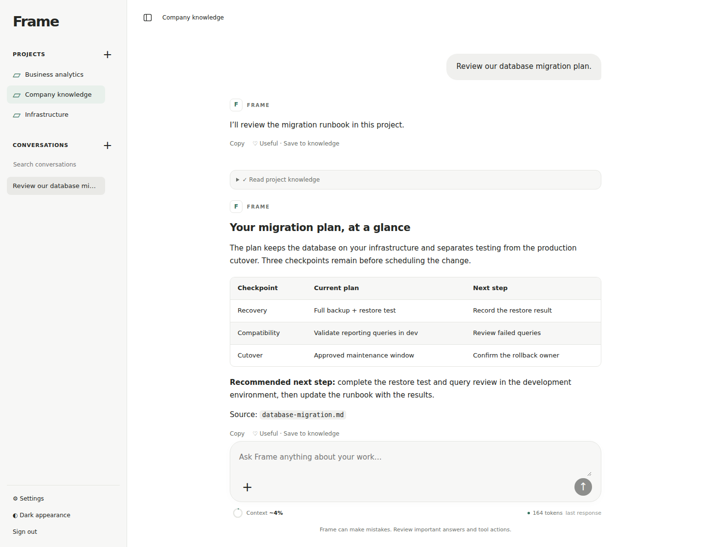
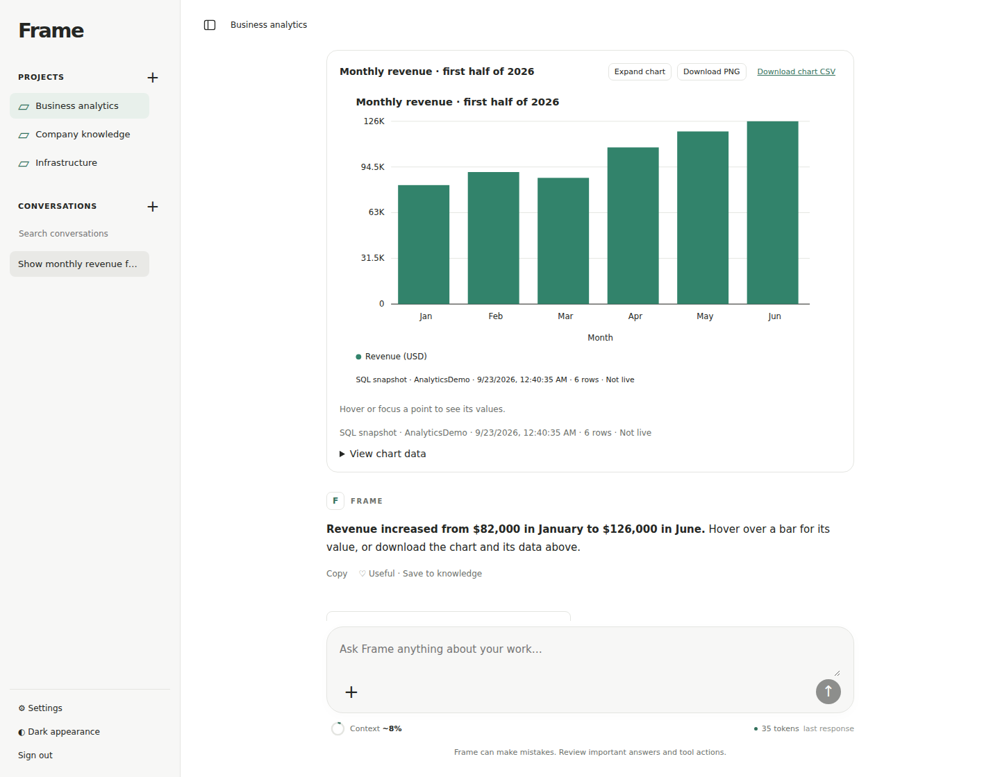

<div align="center">

# Frame

### Your knowledge. Your infrastructure.

A self-hosted AI workspace for company knowledge, SQL analysis, and local models.

[](https://github.com/hgursel/frame/actions/workflows/ci.yml)

[Features](#features) · [Quick start](#quick-start) · [Documentation](#documentation) · [Roadmap](docs/ROADMAP.md)

</div>

Bring your documents, project knowledge, and SQL data into one conversational workspace. Ask questions, investigate results, create charts, and turn useful answers into knowledge you can keep—all with a llama.cpp model running on your own infrastructure.

Frame embeds the **Pi SDK**, so there is no separate Pi installation to manage. Configure your model, projects, and built-in plugins through the web interface.



_The running Frame interface with fictional demonstration content. [Screenshot details](docs/images/README.md)._

## Features

### Company knowledge that grows with your work

- **Bring your documents.** Upload Markdown, TXT, CSV, PDF, and DOCX files. Attach sources to a conversation or ask Frame to search the project's knowledge.
- **Keep useful answers.** Use **Useful → Save to knowledge** on answers and tool results. Review a new Markdown page or an update before saving it.
- **Keep the history.** Knowledge pages include revisions and provenance. Export a portable **Open Knowledge Format 0.2** bundle with an index and change log.
- **Organize by project.** Give each project its own instructions, conversations, files, knowledge, and plugin choices.

[Explore the knowledge workflow →](docs/KNOWLEDGE.md)

### SQL analysis with explicit controls

The built-in **MSSQL plugin** lets you work with SQL Server through conversation:

- Ask questions against administrator-selected databases using SQL Authentication.
- Run supported reads with a separate read-only login; review and approve every enabled write, schema change, or allowlisted stored procedure.
- Initialize searchable schema knowledge so models can find table structures and relationships without rediscovering the database each time.
- Optionally generate per-object notes and business vocabulary, processing large catalogs one object at a time.
- Inspect result tables and download returned rows as CSV.

Configure the shared connection in system settings, then enable MSSQL for individual projects. SQL Server permissions remain the final boundary; the plugin is intended for development databases.

[Set up MSSQL →](docs/MSSQL.md)

### Charts, right in the conversation

Ask for a **bar, line, pie/donut, or scatter chart** from SQL results. Hover for values, toggle legend entries, expand the view, inspect the data, or download PNG and CSV files.

Charts use saved SQL datasets instead of asking the model to copy every value into its context. They remain available when you reopen the conversation, without rerunning the query. Source timestamps and result-limit notices keep snapshots identifiable.



_Fictional sample revenue shown in the running application. Charts is enabled per project; the model is instructed to create charts only when you explicitly ask._

[Set up Charts →](docs/CHARTS.md)

### A familiar workspace for local models

| Capability           | What you can do                                                                                                   |
| -------------------- | ----------------------------------------------------------------------------------------------------------------- |
| Streaming chat       | Follow responses and expandable model-provided reasoning as they arrive.                                          |
| Rich answers         | Read Markdown tables, code blocks, and locally rendered Mermaid diagrams.                                         |
| Context visibility   | See context usage and observed tokens/second; use automatic compaction or create a manual checkpoint.             |
| Document generation  | Install the optional Python document runtime and generate downloadable PDF/DOCX files with trusted tools enabled. |
| Conversation control | Resume saved chats, stop active tasks, and remove conversations or entire projects with confirmation.             |
| Everyday interface   | Use light/dark appearance, conversation search, attachments, and mobile navigation.                               |

## Try asking Frame

| Start with            | Ask                                                                                   |
| --------------------- | ------------------------------------------------------------------------------------- |
| Project documents     | “Review our migration plan and identify the remaining checks. Cite the source files.” |
| SQL Server            | “Which products had the highest revenue last quarter? Show the query results.”        |
| Saved SQL results     | “Turn those results into a bar chart.”                                                |
| A useful conversation | “Draft a knowledge page explaining what we learned so I can review and save it.”      |

SQL examples require the MSSQL plugin and an appropriate schema. Model-driven tools require a compatible model and chat template.

## Quick start

**Requirements:** Ubuntu 26.04, Node.js 24 LTS, npm, and a running llama.cpp server. Frame does not download models or install llama.cpp.

```bash
git clone https://github.com/hgursel/frame.git
cd frame
npm ci
npm run build
npm start
```

1. Open **http://127.0.0.1:3000**. Use the setup token printed in the server console to create an administrator password.
2. Go to **Settings → Model**. Enter your llama.cpp endpoint, such as `http://127.0.0.1:8080/v1`, and the model alias it serves. Save and test the connection.
3. In **Settings → Context**, match the context window to your llama.cpp slot and reserve room for output.
4. Create a project, add documents under **Knowledge**, and start a conversation.
5. For SQL and charts, configure **Settings → Plugins**, enable the plugins in **Project settings**, and initialize database knowledge.

The endpoint is reached from the Frame server. V1 accepts loopback and private IPv4 addresses; internal DNS names are not supported yet. For PDF/DOCX generation, install the optional document runtime from **Settings → Documents**; Ubuntu also needs Python 3 and `python3-venv`.

For access from another computer, follow the [HTTPS reverse-proxy or SSH-tunnel guide](docs/DEPLOYMENT.md). Deployment-level network and storage settings are configured outside the browser.

## Local by design

- **Your model endpoint.** Frame connects to the llama.cpp server you operate, with no cloud-model fallback.
- **Your stored data.** Project files, knowledge, settings, chart datasets, and conversation history stay in the configured data directory on the Frame host.
- **No telemetry.** Frame disables Pi install telemetry and model-catalog network refreshes. Initial dependency installation still requires package downloads.
- **Explicit capabilities.** Enable built-in plugins per project and opt into trusted host tools when you need filesystem or Python/shell execution.

> [!IMPORTANT]
> **V1 supports one administrator.** Multi-user access and isolated execution are planned for V2. Trusted host tools run with the Frame service account's permissions; project folders are not sandboxes. Use a dedicated account and authenticated private access. See [runtime and data boundaries](docs/OPERATIONS.md).

## Documentation

| Guide                                  | Covers                                                                          |
| -------------------------------------- | ------------------------------------------------------------------------------- |
| [Knowledge](docs/KNOWLEDGE.md)         | Uploads, reviewed updates, Markdown pages, OKF export, and Python documents     |
| [MSSQL](docs/MSSQL.md)                 | Connection setup, SQL permissions, approvals, and schema knowledge              |
| [Charts](docs/CHARTS.md)               | Chart types, dataset limits, exports, and saved snapshots                       |
| [Context management](docs/CONTEXT.md)  | Token budgets, compaction, checkpoints, and measurement limits                  |
| [Deployment](docs/DEPLOYMENT.md)       | Ubuntu service setup, private access, updates, and backups                      |
| [Runtime and data](docs/OPERATIONS.md) | Model compatibility, storage layout, credentials, tool boundaries, and deletion |
| [Development](docs/DEVELOPMENT.md)     | Local development, automated checks, browser tests, and references              |
| [Architecture](docs/ARCHITECTURE.md)   | Application structure and Pi SDK integration                                    |
| [Roadmap](docs/ROADMAP.md)             | Implemented features, planned work, and acceptance checks                       |

## Project status and contributing

Frame is an actively developed **single-administrator V1**. MCP management, general skill installation, a packaged installer, and multi-user access are roadmap items. Automated tests cover API behavior, the real Pi SDK with a local mock endpoint, and browser workflows; validate your own llama.cpp model and SQL Server configuration before relying on them.

Have a bug or an idea? [Open an issue](https://github.com/hgursel/frame/issues). For code changes, read [AGENTS.md](AGENTS.md) and the [development guide](docs/DEVELOPMENT.md). Keep reports free of credentials and private organization data.

## Built with

[Pi SDK](https://pi.dev/docs/latest/sdk) · [llama.cpp](https://github.com/ggml-org/llama.cpp) · React · TypeScript · Fastify · SQLite

The knowledge workflow draws on [Google's Open Knowledge Format](https://github.com/GoogleCloudPlatform/open-knowledge-format/blob/main/SPEC.md) and [Karpathy's LLM Wiki pattern](https://gist.github.com/karpathy/442a6bf555914893e9891c11519de94f).

## License

A source license for Frame has not been selected yet. Dependency licenses remain applicable.
